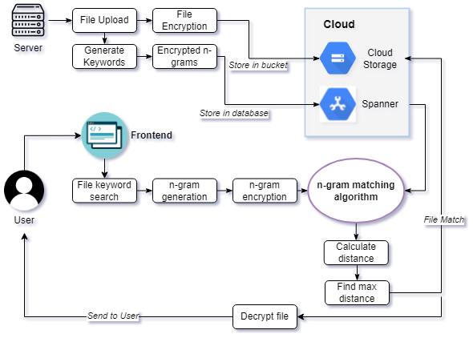

# Fuzzy Search on Encrypted Data in the Cloud
Master Thesis Project 2022

## Server console setup
1. Add Google Cloud project associated `service_account.json` secret file to project directory.
2. Build and run server target with `bazel run //server:run -- [file directory] --ngram_size=3`
    - You must specify a directory
    - ngram_size is not required and the default is 3
3. Run all unit tests with `bazel test //server:*`

Example program run usage:
`bazel run //server:run -- $PWD/files --ngrams=4`

## Web Application Startup
Run backend with `bazel run //application/api:backend`
Run frontend with `cd application && npm run frontend`

## Project Diagram
